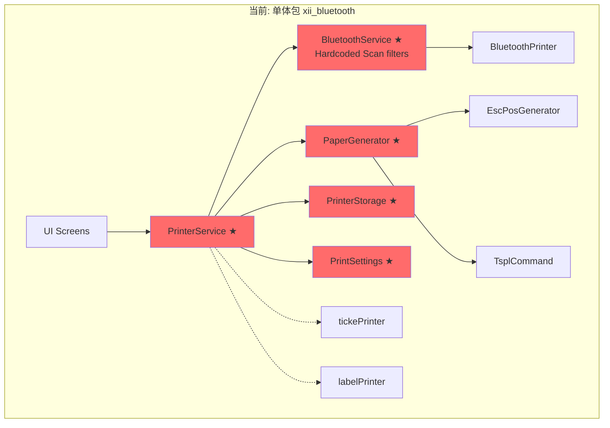
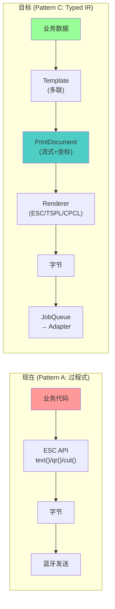
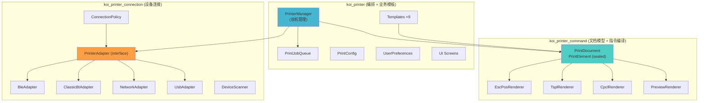
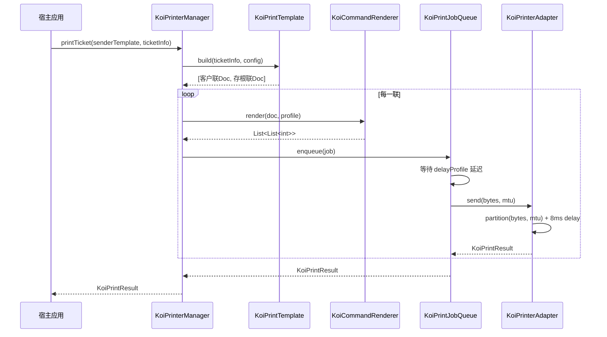
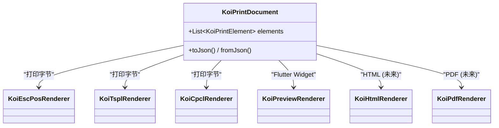
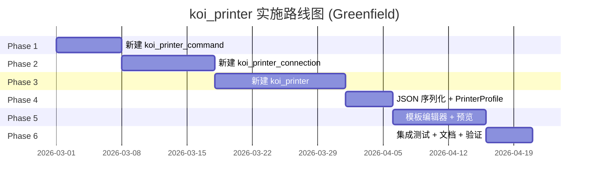

# koi_printer 架构升级方案 v5.0 (Final)
# Architecture Upgrade Plan v5.0 — Mr.Koi Edition

> **文档版本**: 5.0 | **日期**: 2026-02-26 | **状态**: 已审阅 | **品牌**: Mr.Koi
>
> 基于 4 年遗留代码 (`xii_bluetooth`) 逐文件深度审计 (60+ files, ~3800 LOC)，覆盖全部实战场景。
> (包含双设备并行、坐标系排版、独立联切纸偏好、动态硬编码延迟池等 8 项核心补齐)
>
> **[v5.0 变更记录]**:
> - 实施策略变更: 从原地重构 → **Greenfield 全新项目** (旧代码仅作只读参考)
> - 品牌重命名: 所有新文件/包使用 `koi_` 前缀 (以 Mr.Koi 身份发布)
> - 补充了 USB/网络打印服务映射、交款/测试小票业务模板映射

---

## 目录 / Table of Contents

1. [项目现状](#1-项目现状)
2. [核心设计原则](#2-核心设计原则)
3. [当前架构 vs 目标架构](#3-当前架构-vs-目标架构)
4. [问题清单 (20 项)](#4-问题清单)
5. [竞品调研结论](#5-竞品调研结论)
6. [模块拆分方案 (3 包)](#6-模块拆分方案)
7. [核心接口设计](#7-核心接口设计)
8. [JSON 序列化 + 动态列表模板](#8-json-序列化--动态列表模板)
9. [打印机能力数据库 (PrinterProfile)](#9-打印机能力数据库)
10. [模板编辑器 + 预览](#10-模板编辑器--预览)
11. [平滑兼容与过渡策略](#11-平滑兼容与过渡策略)
12. [文件迁移映射](#12-文件迁移映射)
13. [依赖治理](#13-依赖治理)
14. [分阶段实施路线 (6 阶段)](#14-分阶段实施路线)
15. [风险评估](#15-风险评估)

---

## 1. 项目现状

`xii_bluetooth` 是一个 Flutter 打印机插件，支持 BLE/经典蓝牙/网络/USB 连接 + ESC/CPCL/TSPL 协议，用于 TMS 场景下的小票和标签打印。

| 指标 | 数据 |
|------|------|
| 源文件 | 60+ files, ~3800 LOC |
| 目录 | `command/` `devices/` `esc_ff/` `papper/` `screens/` `services/` `types/` |
| 测试覆盖 | **0%** (空测试桩) |
| 单例数 | 6+ (Service/Storage/Settings) |
| SDK | Dart 3.2+ / Flutter |



> ★ = Singleton | 红色 = 紧耦合高风险节点
> 注意: PrinterService **同时管理两台**打印机 (tickePrinter + labelPrinter)

---

## 2. 核心设计原则

| # | 原则 | 说明 |
|---|------|------|
| 1 | **适应所有打印机** | 连接层抽象 → 新增打印机只需实现 `PrinterAdapter` |
| 2 | **适应所有指令协议** | 指令层抽象 → 新增协议只需实现 `CommandRenderer` |
| 3 | **流式 + 坐标两种排版** | ESC/POS 用流式布局，TSPL/CPCL 标签用绝对坐标定位 |
| 4 | **模板与指令分离** | Template → PrintDocument → Renderer → bytes |
| 5 | **模板基于指令能力设计** | `PrintElement` sealed class 与协议能力对齐，编译时安全 |
| 6 | **一份文档多种输出** | PrintDocument → 打印 / 预览 Widget / HTML / PDF，统一 IR |
| 7 | **双机并行管理** | 小票打印机 + 标签打印机同时在线、独立连接 |

### 数据流

```
业务数据 (TicketInfo / LabelInfo)
    ↓  Template.build()
List<PrintDocument> (协议无关 IR — 支持多联)
    ↓  CommandRenderer.render()
List<int> (协议字节 — ESC/TSPL/CPCL)
    ↓  PrintJobQueue.enqueue()
    ↓  PrinterAdapter.send() — MTU 分块 + 平台延迟
🖨️ 打印机硬件
```

---

## 3. 当前架构 vs 目标架构



---

## 4. 问题清单

### 🔴 P0 — 必须修复

| # | 问题 | 位置 |
|---|------|------|
| 1 | 零测试覆盖 | `test/` |
| 2 | 全局单例泛滥 (6+) | 所有 Service/Storage/Settings |
| 3 | 无依赖注入 | 全项目 `.instance` 调用 |
| 4 | 无结构化错误处理 | 异常被 `debugPrint` 吞没 |
| 5 | USB `late var` 无类型 | `xii_usb_printer.dart:28` |
| 6 | BLE 扫描硬编码过滤 | `withNames: ["Bluno"]` |

### 🟡 P1 — 重要

| # | 问题 | 位置 |
|---|------|------|
| 7 | 广泛拼写错误 | `papper` `gengrator` `connnect` `isReay` `perpair` |
| 8 | 重复结果类 | `PosPrintResult` ≈ `ConnectConnectResult` |
| 9 | 大量注释代码 | `xii_usb_printer.dart` ~80 行注释 |
| 10 | UI 直接访问 Singleton | `screens/` → `Storage.instance` |
| 11 | 硬编码中文字符串 | 模板常量 |
| 12 | 静态可变状态 | `isDiscoveringServices` |
| 13 | 设备名黑名单硬编码 | 过滤 "macbook" "iphone" "耳塞" |
| 14 | int 常量替代 enum | `XIIConnnectType` |

### 🟢 P2 — 优化

| # | 问题 |
|---|------|
| 15 | 过期 `flutter_lints` |
| 16 | `image: any` / `shared_preferences: any` 无版本约束 |
| 17 | Platform Interface 空壳 |
| 18 | StreamController 未 close |
| 19 | `connectWithRetry` 240 次无退避 |
| 20 | README 仅模板文本 |

---

## 5. 竞品调研结论

> 详细分析见 [competitive_analysis.md](competitive_analysis.md)

| 项目 | 架构模式 | 模板 | 多协议 | 多连接 |
|------|---------|------|--------|--------|
| `bluetooth_print_plus` (Flutter) | 过程式 | ❌ | ✅ ESC+TSC+CPCL | ❌ 仅蓝牙 |
| `esc_pos_utils_plus` (Dart) | 过程式 | ❌ | ❌ 仅 ESC | ❌ 无 |
| `ticketfile` (Go) ★ | **DSL→Converter** | ✅ | ❌ 仅 ESC+HTML | ❌ 仅 stdout |
| `python-escpos` (Python) | 过程式+继承 | ❌ | ❌ 仅 ESC | ✅ USB/Net/Serial |
| `py-xml-escpos` (Python) | XML 模板 | ✅ | ❌ 仅 ESC | ❌ |
| `PAPPL/CUPS` (C) | 企业级驱动 | ✅ | ✅ | ✅ |
| **koi_printer (Mr.Koi)** | **Typed IR** | ✅ | ✅ | ✅ |

> [!IMPORTANT]
> **Flutter/Dart 生态中没有任何项目同时实现模板-指令分离 + 多协议 + 多连接 + 类型安全。**

---

## 6. 模块拆分方案

### 三个包 + 依赖方向



### 项目目录结构 (Greenfield)

```
xii_engine/packages/
├── xii_bluetooth_null_safety/        ← 旧代码 (只读参考，不再修改)
├── koi_printer/                      ← 新建：编排 + 模板接口 + Demo
│   ├── lib/src/
│   │   ├── service/                    ← KoiPrinterManager, KoiPrintJobQueue
│   │   ├── config/                     ← KoiPrintConfig, KoiUserPreferences
│   │   ├── storage/                    ← KoiPrinterStorage
│   │   ├── model/                      ← 数据模型 + 常量
│   │   ├── template/                   ← 仅 KoiPrintTemplate<T> 抽象接口
│   │   └── ui/                         ← 通用 UI 组件
│   └── example/                        ← Demo App + 全部模板实现
│       ├── templates/
│       │   ├── simple_receipt_template.dart     ← 通用小票示例
│       │   ├── simple_label_template.dart       ← 通用标签示例
│       │   ├── koi_sender_ticket_template.dart  ← TMS: 发货小票 (多联)
│       │   ├── koi_receiver_ticket_template.dart← TMS: 收货小票
│       │   ├── koi_delivery_note_template.dart  ← TMS: 发放明细
│       │   ├── koi_deposit_template.dart        ← TMS: 缴款单
│       │   ├── koi_refund_ticket_template.dart  ← TMS: 退票
│       │   ├── koi_payment_request_template.dart← TMS: 交款申请
│       │   ├── koi_test_ticket_template.dart    ← TMS: 测试小票
│       │   └── koi_sender_label_template.dart   ← TMS: 标签 (6种样式)
│       └── main.dart
├── koi_printer_command/              ← 新建：文档模型 + 指令编译
└── koi_printer_connection/            ← 新建：设备连接
```

> [!IMPORTANT]
> **模板分层策略**:
> - `koi_printer` 库仅提供 `KoiPrintTemplate<T>` 抽象接口 + 工具方法
> - `koi_printer/example` 包含全部模板实现（通用 Demo + TMS 业务模板）
> - 用户可直接参考 example 中的模板实现自己的业务需求

> [!TIP]
> **Greenfield 策略**: 新建 3 个 `koi_*` 包，旧 `xii_bluetooth` 仅作只读参考。
> 每完成一个模块，在旧代码对应文件上打 ✅ 标记，最终确认 60+ 文件全部覆盖。

### 职责边界

| 包 | 知道什么 | 不知道什么 | 纯 Dart |
|---|---------|-----------|---------|
| `koi_printer_connection` | 连接/传输字节/重连策略 | 字节内容、业务 | ❌ (需 Flutter) |
| `koi_printer_command` | KoiPrintDocument → 协议字节/预览 Widget | 谁消费、传输、业务 | ✅ (预览除外) |
| `koi_printer` | 双机管理/队列/模板接口/用户偏好 | 协议细节、连接细节 | ❌ (需 Flutter) |

### 扩展性验证

| 场景 | 改 | 不改 |
|------|---|------|
| 新增连接 (WiFi Direct) | `connection` + 新 Adapter | command, printer |
| 新增协议 (ZPL II) | `command` + 新 Renderer | connection, printer |
| 新增单据 (退款单) | example + 新 Template | command, connection, printer |
| 替换 ESC/POS 库 | 仅改 `KoiEscPosRenderer` 内部 | 其他全部不改 |
| 新增标签样式 (第7种) | example + 新 Template | command, connection, printer |

---

## 7. 核心接口设计

### 7.1 KoiPrintDocument + KoiPrintElement (Package: koi_printer_command)

```dart
class KoiPrintDocument {
  final KoiPaperType paperType;     // ticket / label
  final KoiPaperSize paperSize;     // mm80 / mm58 / custom(w,h)
  final KoiLayoutMode layoutMode;   // flow (ESC) / positioned (TSPL/CPCL)
  final List<KoiPrintElement> elements;
}

sealed class KoiPrintElement {}

// ═══════════════════════════════════════════
// 流式布局元素 (ESC/POS 小票)
// ═══════════════════════════════════════════
class KoiTextElement       extends KoiPrintElement { String text; KoiTextSize size; TextAlign align; bool bold; bool reverse; }
class KoiTextRowElement    extends KoiPrintElement { List<KoiTextColumn> columns; }
class KoiQrCodeElement     extends KoiPrintElement { String data; KoiQrSize size; KoiQrRenderStrategy strategy; }
class KoiBarcodeElement    extends KoiPrintElement { String data; KoiBarcodeType type; int height; }
class KoiImageElement      extends KoiPrintElement { Uint8List imageBytes; int? width; }
class KoiDividerElement    extends KoiPrintElement { String char; }
class KoiSpacerElement     extends KoiPrintElement { int lines; }
class KoiCutElement        extends KoiPrintElement { KoiCutMode mode; }

// ═══════════════════════════════════════════
// 绝对坐标元素 (TSPL/CPCL 标签)
// 来源: 旧 XIISenderLabel 的 addText(x, y, size, txt) 模式
// ═══════════════════════════════════════════
class KoiLabelSetupElement       extends KoiPrintElement { int widthMm; int heightMm; int gapMm; int dpi; }
class KoiPositionedTextElement   extends KoiPrintElement { int x; int y; int fontSize; String font; int rotation; String text; }
class KoiPositionedBarcodeElement extends KoiPrintElement { int x; int y; int height; String data; String type; }
class KoiPositionedQrCodeElement extends KoiPrintElement { int x; int y; int cellSize; String data; }
class KoiLabelBoxElement         extends KoiPrintElement { int x; int y; int width; int height; int thickness; }
class KoiLabelReverseElement     extends KoiPrintElement { int x; int y; int width; int height; }
class KoiLabelPrintElement       extends KoiPrintElement { int copies; }

// ═══════════════════════════════════════════
// 动态列表元素 (JSON 模板用)
// ═══════════════════════════════════════════
class KoiForEachElement extends KoiPrintElement {
  final String listKey;
  final KoiPrintElement itemTemplate;
}
```

> [!NOTE]
> **流式 vs 坐标是两种正交的排版模型。** ESC/POS 小票是自上而下流式排版 (类似 HTML),
> TSPL/CPCL 标签是绝对坐标定位 (类似 Canvas)。`LayoutMode` 字段让 Renderer 知道
> 该用哪种模式解释 elements。

### 7.2 KoiCommandRenderer (Package: koi_printer_command)

```dart
abstract interface class KoiCommandRenderer {
  List<List<int>> render(KoiPrintDocument document, {KoiPrinterProfile? profile});
  KoiCommandProtocol get protocol;
}

// 实现:
// - KoiEscPosRenderer  → 处理流式元素, QR 多策略降级
// - KoiTsplRenderer    → 处理坐标定位元素
// - KoiCpclRenderer    → 处理坐标定位元素
// - KoiPreviewRenderer → 输出 Flutter Widget (§10)
```

### 7.3 KoiPrinterAdapter + KoiConnectionPolicy (Package: koi_printer_connection)

```dart
abstract interface class KoiPrinterAdapter {
  Future<KoiConnectionResult> connect(KoiDeviceAddress address, {KoiConnectionConfig? config});
  Future<void> disconnect();

  /// 发送数据。KoiBleAdapter 内部根据 MTU 自动分块 (Chunking)
  /// 参考老代码: partition(bytes, mtu) + 8ms 平台延迟
  Future<void> sendData(List<int> bytes, {int? mtu});

  Stream<KoiConnectionState> get stateStream;
  Stream<KoiPrinterHardwareState> get hardwareStateStream;
  Future<KoiPrinterHardwareState> queryHardwareState();

  bool get isConnected;
  KoiConnectionType get type;
}

/// 连接策略 — 从老代码 240 次 retry + 3 秒定时器 + 2 秒自动断连提炼
class KoiConnectionPolicy {
  final Duration autoReconnectInterval;  // 默认 3s (来自 _autoConnectDuration)
  final int maxRetries;                   // 默认 10 (替代硬编码 240)
  final Duration retryDelay;              // 默认 20ms (来自 connectDelayDuration)
  final KoiRetryStrategy retryStrategy;   // linear / exponential
  final Duration? autoDisconnectAfter;    // 网络/经典蓝牙用, 默认 2s
}

/// 连接配置 — 从旧 XIIPrinterConfig 中拆出的连接层字段
class KoiConnectionConfig {
  final String deviceId;
  final String serviceId;             // BLE service UUID
  final String characteristicId;      // BLE characteristic UUID
  final int mtu;
  final bool multiConnection;         // 是否多连接模式
}
```

### 7.4 KoiPrintTemplate + KoiPrinterManager + KoiPrintJobQueue (Package: koi_printer)

```dart
/// 模板 — 返回 List 支持多联打印 (客户联 + 存根联)
abstract class KoiPrintTemplate<T> {
  List<KoiPrintDocument> build(T data, KoiPrintConfig config);
}

/// 打印机管理器 — 同时管理小票机 + 标签机
class KoiPrinterManager {
  KoiPrinterAdapter? ticketAdapter;
  KoiPrinterAdapter? labelAdapter;

  final KoiPrintJobQueue _ticketQueue = KoiPrintJobQueue();
  final KoiPrintJobQueue _labelQueue = KoiPrintJobQueue();

  Future<void> connectAll(KoiPrinterStorage storage);
  Future<void> disconnectAll();

  Future<KoiPrintResult> printTicket<T>({
    required KoiPrintTemplate<T> template,
    required T data,
    required KoiPrintConfig config,
  });

  Future<KoiPrintResult> printLabel<T>({
    required KoiPrintTemplate<T> template,
    required T data,
    required KoiPrintConfig config,
  });
}

/// 打印任务队列 — 替代 Queue + Future.delayed 模式
class KoiPrintJobQueue {
  Future<KoiPrintResult> enqueue(KoiPrintJob job);

  // 批量打印时根据 KoiDelayProfile 计算任务间延迟
  // 来源: 旧 XIIPrinterDelayConfig.delayed(action, isBatch)
}

/// 渲染配置 — 从旧 XIIPrinterConfig 中拆出的渲染层字段
class KoiRendererConfig {
  final KoiCommandProtocol protocol;        // ESC/TSPL/CPCL
  final KoiQrRenderStrategy qrStrategy;     // normal/legend/original/zk/img/barcode
}

/// 打印配置 — 从旧 XIIPrinterConfig 中拆出的业务层字段
class KoiPrintConfig {
  final KoiDeviceRole deviceRole;           // ticketDesktop/ticketPortable/labelDesktop/labelPortable
  final KoiPaperSize paperSize;             // mm80/mm58
  final KoiRendererConfig renderer;
  final KoiCutBehavior cutBehavior;         // 来自旧 XIIPrintSettings.isCut()
  final KoiPrintStyle printStyle;           // normal/large (来自旧 XIISenderPrintStyle)
  final KoiLabelStyle? labelStyle;          // 6 种标签样式
  final KoiDelayProfile delayProfile;       // 来自旧 XIIPrinterDelayConfig
  final int headerEmptyLines;               // 来自旧 reciverClientHeaderLine()
}
```

### 7.5 QR 码多策略渲染

```dart
/// 来源: 旧 XIIEscPosPaper.addQRAllInOne() 的 6 条分支
enum KoiQrRenderStrategy {
  normal,     // 标准 ESC/POS QR 指令
  legend,     // 老台式机 V1 指令
  original,   // 老便携 V2 指令
  zk,         // 芝科专用指令
  img,        // 降级为图片打印 (zxing → image → raster)
  barcode,    // 降级为条形码
}
```

> [!WARNING]
> 这 6 种策略是 4 年实跑中**针对不同打印机型号的兼容降级方案**。
> 如果新架构不保留，芝科/2016 款台式机的 QR 打印会失败。
> 长期方案: 由 `KoiPrinterProfile` 能力库自动选择策略，用户无需手动配置。

### 7.6 完整生命周期



---

## 8. JSON 序列化 + 动态列表模板

> 借鉴: **py-xml-escpos** (XML 模板序列化) + **ticketfile** (文本 DSL)

### 8.1 KoiPrintElement JSON 序列化

```dart
sealed class KoiPrintElement {
  Map<String, dynamic> toJson();

  factory KoiPrintElement.fromJson(Map<String, dynamic> json) {
    return switch (json['type'] as String) {
      'text'             => KoiTextElement.fromJson(json),
      'textRow'          => KoiTextRowElement.fromJson(json),
      'qrCode'           => KoiQrCodeElement.fromJson(json),
      'barcode'          => KoiBarcodeElement.fromJson(json),
      'image'            => KoiImageElement.fromJson(json),
      'divider'          => KoiDividerElement.fromJson(json),
      'spacer'           => KoiSpacerElement.fromJson(json),
      'cut'              => KoiCutElement.fromJson(json),
      'labelSetup'       => KoiLabelSetupElement.fromJson(json),
      'positionedText'   => KoiPositionedTextElement.fromJson(json),
      'forEach'          => KoiForEachElement.fromJson(json),
      _ => throw FormatException('Unknown: ${json["type"]}'),
    };
  }
}
```

### 8.2 JSON 模板示例 (含动态列表)

```json
{
  "paperType": "ticket",
  "paperSize": "mm80",
  "layoutMode": "flow",
  "elements": [
    {"type": "text", "text": "{{companyName}}", "size": "size2", "align": "center", "bold": true},
    {"type": "divider"},
    {"type": "textRow", "columns": [
      {"text": "商品", "ratio": 3}, {"text": "单价", "ratio": 1}, {"text": "小计", "ratio": 1}
    ]},
    {
      "type": "forEach",
      "listKey": "items",
      "itemTemplate": {
        "type": "textRow",
        "columns": [
          {"text": "{{name}}", "ratio": 3},
          {"text": "{{price}}", "ratio": 1},
          {"text": "{{total}}", "ratio": 1}
        ]
      }
    },
    {"type": "divider"},
    {"type": "qrCode", "data": "{{qrUrl}}", "size": 6, "strategy": "normal"},
    {"type": "cut"}
  ]
}
```

### 8.3 变量模板引擎

```dart
class KoiTemplateEngine {
  /// 处理 {{variable}} 占位符 和 forEach 数组展开
  static KoiPrintDocument resolve(
    Map<String, dynamic> templateJson,
    Map<String, dynamic> variables,  // 支持嵌套 Map 和 List
  ) {
    // 1. 遇到普通文本 → 正则替换 {{var}}
    // 2. 遇到 forEach → 提取 listKey, 查出 List<Map>, 展开为多个 Element
    // 3. 返回完整 KoiPrintDocument
  }
}
```

### 8.4 应用场景

| 场景 | 方式 | 说明 |
|------|------|------|
| **开发时** | 代码构建 `KoiPrintDocument(elements: [...])` | IDE 类型提示 + 编译检查 |
| **远程下发** | 服务器存 JSON 模板 → 客户端解析 | 免发版修改打印格式 |
| **用户自定义** | 编辑器生成 JSON → SharedPreferences | 用户可调整单据格式 |
| **模板共享** | JSON 导入/导出 | 不同 TMS 站点共享模板 |

---

## 9. 打印机能力数据库

> 借鉴: **esc_pos_utils_plus** (CapabilityProfile) + **python-escpos** (printer-db)

### 9.1 KoiPrinterProfile

```dart
class KoiPrinterProfile {
  final String id;
  final String name;
  final String vendor;
  final List<KoiCommandProtocol> supportedProtocols;
  final List<KoiConnectionType> supportedConnections;
  final int paperWidthMm;
  final int dotsPerLine;
  final int dpi;
  final bool supportsCut;
  final bool supportsQrCode;
  final KoiQrRenderStrategy bestQrStrategy;   // 最佳 QR 策略 (来自实战经验)
  final bool supportsChinese;
  final int? maxMtu;
  final KoiDelayProfile? delayProfile;        // 该型号的推荐延迟配置
}
```

### 9.2 printers.json 扩展

```json
{
  "id": "xprinter_xt423",
  "name": "芯烨 XT-423",
  "vendor": "Xprinter",
  "protocols": ["escPos"],
  "connections": ["ble"],
  "paperWidthMm": 80,
  "dotsPerLine": 576,
  "dpi": 203,
  "supportsCut": true,
  "supportsQrCode": true,
  "bestQrStrategy": "legend",
  "characteristicFilter": "0000fff2",
  "supportsChinese": true,
  "delayProfile": "table2018_2016"
}
```

### 9.3 Renderer 能力感知

```dart
class KoiEscPosRenderer implements KoiCommandRenderer {
  @override
  List<List<int>> render(KoiPrintDocument doc, {KoiPrinterProfile? profile}) {
    for (final element in doc.elements) {
      switch (element) {
        case KoiQrCodeElement e:
          final strategy = profile?.bestQrStrategy ?? e.strategy;
          _renderQr(e, strategy);  // 根据型号自动选择最佳策略
      }
    }
  }
}
```

---

## 10. 模板编辑器 + 预览

### 10.1 PreviewRenderer = 另一种 Renderer



### 10.2 编辑器 UI 布局

```
┌─────────────────────────────────────────────────┐
│  模板编辑器                      [保存] [打印测试] │
├──────────────────┬──────────────────────────────┤
│  元素列表 (左)    │    实时预览 (右)              │
│  ┌──────────┐   │    ┌──────────────────┐      │
│  │📝 公司名  │   │    │   *** 公司名 ***   │      │
│  │📝 广告语  │   │    │   广告语文本       │      │
│  │── 分割线  │   │    │   ───────────    │      │
│  │📝 运单号  │   │    │   运单号: xxxxx   │      │
│  │🔲 QR码   │   │    │   ┌──────┐       │      │
│  │✂️ 切纸   │   │    │   │ ▪▪▪▪ │       │      │
│  └──────────┘   │    │   ✂️·········    │      │
│  [+ 添加元素]    │    └──────────────────┘      │
├──────────────────┴──────────────────────────────┤
│  属性面板: 文字[____] 大小[▼ size2] 对齐[居中]    │
└─────────────────────────────────────────────────┘
```

### 10.3 工作量评估

| 功能 | 实现方式 | 工作量 |
|------|---------|--------|
| 小票预览 | `PreviewRenderer` | 2-3 天 |
| 标签预览 | 坐标定位 → `CustomPaint` | 3-4 天 |
| 元素属性编辑 | 每类 Element 一个表单 | 3-4 天 |
| 拖拽排序 | `ReorderableListView` | 1 天 |
| JSON 导入/导出 | `toJson/fromJson` | 已含 |
| QR/条码预览 | `qr_flutter` + `barcode` | 1 天 |
| **总计** | | **~2.5 周** |

---

## 11. Greenfield 迁移与过渡策略

> [!IMPORTANT]
> **策略变更**: 不再原地重构，而是创建全新 `koi_*` 项目，旧 `xii_bluetooth` 仅作只读参考。
> 宿主应用 (TMS) 在新包完成验证后一次性切换依赖。

### 迁移优势

| 优势 | 说明 |
|------|------|
| 🔍 防遗漏 | 旧代码始终在旁做 checklist，逐文件对照确认 |
| 🧪 边建边测 | 从第一行代码就写测试，不存在"零覆盖"问题 |
| 🏗️ 架构纯净 | 没有残留的 Singleton、拼写错误、注释代码 |
| 🔄 无中断 | TMS 宿主应用继续使用旧包，直到新包通过真机验证 |

### 宿主应用切换方式

```yaml
# TMS pubspec.yaml — 切换前
dependencies:
  xii_bluetooth:
    path: ../xii_bluetooth_null_safety

# TMS pubspec.yaml — 切换后
dependencies:
  koi_printer:
    path: ../koi_printer
  koi_printer_command:
    path: ../koi_printer_command
  koi_printer_connection:
    path: ../koi_printer_connection
```

### XIIPrinterConfig → 新 Koi 配置拆分映射

| 旧字段 (xii_bluetooth) | 新归属 | 新类 (koi_printer*) |
|--------|--------|------|
| `deviceId, serviceId, characteristicId, mtu, multiConnection` | connection | `ConnectionConfig` |
| `cmdType` | command | `RendererConfig.protocol` |
| `qrType` | command | `RendererConfig.qrStrategy` |
| `deviceType, printerWidth, delayConfig` | printer | `PrintConfig` |

### XIIPrintSettings → 新 Koi 配置拆分映射

| 旧方法 (xii_bluetooth) | 新归属 (koi_printer) |
|--------|--------|
| `isCut(action)` | `PrintConfig.cutBehavior` |
| `senderPrintType()` | `PrintConfig.stubType` |
| `printSenderStyle()` | `PrintConfig.printStyle` |
| `senderLabelStyle()` | `PrintConfig.labelStyle` |
| `reciverClientHeaderLine()` | `PrintConfig.headerEmptyLines` |

---

## 12. 文件对照映射 (旧 xii_ → 新 koi_)

> 旧文件路径前缀: `xii_bluetooth_null_safety/lib/src/`
> 新文件使用 `koi_` 前缀，在全新包中创建。

### → `koi_printer_connection`

| 旧文件 (xii_bluetooth) | 新文件 (koi_printer_connection) | ✅ |
|--------|--------|---|
| `devices/xii_base_printer.dart` | `lib/src/adapter/koi_printer_adapter.dart` + `lib/src/policy/koi_connection_policy.dart` | |
| `devices/xii_bluetooth_printer.dart` | `lib/src/adapter/koi_ble_adapter.dart` | |
| `devices/xii_bluetooth_serial_printer.dart` | `lib/src/adapter/koi_classic_bt_adapter.dart` | |
| `devices/xii_network_printer.dart` | `lib/src/adapter/koi_network_adapter.dart` | |
| `devices/xii_usb_printer.dart` | `lib/src/adapter/koi_usb_adapter.dart` | |
| `services/xii_bluetooth_service.dart` | `lib/src/scanner/koi_ble_scanner.dart` | |
| `services/xii_bluetooth_serial_service.dart` | `lib/src/scanner/koi_classic_bt_scanner.dart` | |
| `services/xii_network_service.dart` | `lib/src/scanner/koi_network_scanner.dart` | |
| `services/xii_usb_service.dart` | `lib/src/scanner/koi_usb_scanner.dart` | |
| — | `lib/src/model/koi_connection_config.dart` | |

### → `koi_printer_command`

| 旧文件 (xii_bluetooth) | 新文件 (koi_printer_command) | ✅ |
|--------|--------|---|
| — | `lib/src/model/koi_print_document.dart` + `lib/src/model/koi_print_element.dart` | |
| `command/esc/*.dart` (8 文件) | `lib/src/renderer/koi_esc_pos_renderer.dart` | |
| `command/cpcl/*.dart` | `lib/src/renderer/koi_cpcl_renderer.dart` | |
| `command/tspl/*.dart` | `lib/src/renderer/koi_tspl_renderer.dart` | |
| — | `lib/src/renderer/koi_preview_renderer.dart` | |

### → `koi_printer`

| 旧文件 (xii_bluetooth) | 新文件 (koi_printer) | ✅ |
|--------|--------|---|
| `xii_printer_service.dart` | `lib/src/service/koi_printer_manager.dart` + `lib/src/service/koi_print_job_queue.dart` | |
| `xii_tms_papper_generator.dart` | (逻辑分发到 `KoiPrinterManager` + TMS 宿主项目模板) | |
| `papper/xii_base_ticket_papper.dart` | (基础工具方法整合到 `KoiPrintTemplate` 接口) | |
| `papper/xii_base_label_papper.dart` | (基础工具方法整合到 `KoiPrintTemplate` 接口) | |
| `papper/xii_papper_const.dart` | `lib/src/model/koi_printer_constants.dart` | |
| `xii_pint_settings.dart` | `lib/src/config/koi_print_config.dart` + `lib/src/config/koi_user_preferences.dart` | |
| `xii_printer_storage.dart` | `lib/src/storage/koi_printer_storage.dart` | |
| `xii_printer_profile.dart` | `lib/src/model/koi_printer_profile.dart` (扩展能力数据库) | |
| `types/*.dart` | `lib/src/model/koi_*.dart` | |
| `screens/*.dart` | `lib/src/ui/koi_*.dart` | |
| — | `lib/src/template/koi_print_template.dart` (抽象接口) | |
| — | `example/templates/simple_receipt_template.dart` (Demo) | |
| — | `example/templates/simple_label_template.dart` (Demo) | |

### → `koi_printer/example` (业务模板)

> 以下模板在 example 中实现 `KoiPrintTemplate<T>`，作为参考实现和 TMS 示例。

| 旧文件 (xii_bluetooth) | 新文件 (koi_printer/example) | ✅ |
|--------|--------|---|
| `papper/xii_sender_ticket.dart` | `example/templates/koi_sender_ticket_template.dart` | |
| `papper/xii_recevier_ticket.dart` | `example/templates/koi_receiver_ticket_template.dart` | |
| `papper/xii_issued_papper.dart` | `example/templates/koi_delivery_note_template.dart` | |
| `papper/xii_payment_papper.dart` | `example/templates/koi_deposit_template.dart` | |
| `papper/xii_back_ticket.dart` | `example/templates/koi_refund_ticket_template.dart` | |
| `papper/xii_sender_label.dart` | `example/templates/koi_sender_label_template.dart` (6种) | |

---

## 13. 依赖治理

### 版本锁定

```diff
-  image: any
+  image: ^4.5.0
-  shared_preferences: any
+  shared_preferences: ^2.5.4
-  quiver: any
+  quiver: ^3.2.0
-  flutter_lints: any
+  very_good_analysis: ^10.2.0  # 替代 flutter_lints，最严格校验
```

### 依赖升级

| 包 | 当前 | 最新 | 动作 |
|---|------|------|------|
| `flutter_blue_plus` | ^1.30.5 | 2.1.1 | 先锁 ^1.35.0，后规划 2.x |
| `flutter_bluetooth_classic_serial` | ^1.0.3 | 1.3.2 | 升级到 ^1.3.2 |
| `printing` | ^5.11.1 | 5.14.2 | 升级到 ^5.14.2 |
| `zxing2` | ^0.2.1 | 0.2.4 | 升级到 ^0.2.4 |

### 依赖移除/替换

| 包 | 动作 | 原因 |
|---|------|------|
| `ping_discover_network_forked` | 🗑️ 移除 → 自实现 50 行 | 4 年不更新 |
| `quiver` | ⚠️ 评估移除 | 仅用 `partition`，可内联 |
| 自维护 `EscPosGenerator` (900 LOC) | 🔄 替换 → `esc_pos_utils_plus` | 功能 80% 重合 |

### 新包依赖

| 包 | 依赖 |
|---|------|
| `koi_printer_connection` | `flutter_blue_plus`, `flutter_bluetooth_classic_serial` |
| `koi_printer_command` | `hex`, `gbk_codec`, `image`, `zxing2` (纯 Dart) |
| `koi_printer` | 上述两个 + `shared_preferences`, `printing`, `qr_flutter`, `barcode` |

---

## 14. 分阶段实施路线 (Greenfield)



> [!NOTE]
> **Phase 0 已取消**: Greenfield 策略下无需清理旧代码。旧 `xii_bluetooth` 保持冻结，仅作参考。

### Phase 1: 新建 `koi_printer_command` (1 周) — 低风险

- [ ] `flutter create --template=package koi_printer_command`
- [ ] 定义 `KoiPrintDocument` + `KoiPrintElement` sealed class (**含流式+坐标两类**)
- [ ] 定义 `KoiCommandRenderer` 接口
- [ ] 参考旧 `command/esc/*` → 实现 `KoiEscPosRenderer` (含 6 种 QR 策略)
- [ ] 参考旧 `command/tspl/*` → 实现 `KoiTsplRenderer` (处理坐标定位元素) 
- [ ] 参考旧 `command/cpcl/*` → 实现 `KoiCpclRenderer`
- [ ] 创建 `KoiPrintResult` sealed class
- [ ] 单元测试: Renderer 输出与旧代码一致
- [ ] 在旧代码对应文件上标记 ✅

### Phase 2: 新建 `koi_printer_connection` (1-2 周) — 中风险

- [ ] `flutter create --template=plugin koi_printer_connection`
- [ ] 定义 `KoiPrinterAdapter` 接口 (**含 hardwareStateStream**)
- [ ] 定义 `KoiConnectionPolicy` (自动重连 + 自动断连 + 重试策略)
- [ ] 定义 `KoiConnectionConfig`
- [ ] 参考旧 BLE Printer → 实现 `KoiBleAdapter` (保留 MTU chunking + 平台延迟逻辑)
- [ ] 参考旧 Serial Printer → 实现 `KoiClassicBtAdapter`
- [ ] 参考旧 Network Printer → 实现 `KoiNetworkAdapter`
- [ ] 参考旧 USB Printer → 实现 `KoiUsbAdapter`
- [ ] 实现 `KoiNetworkScanner` (替代 `ping_discover_network_forked`)
- [ ] 单元测试: mock 连接 + 发送
- [ ] 在旧代码对应文件上标记 ✅

### Phase 3: 新建 `koi_printer` + 业务模板 (2 周) — 中风险

- [ ] `flutter create --template=package koi_printer`
- [ ] 实现 `KoiPrinterManager` (**双打印机管理: ticket + label**)
- [ ] 实现 `KoiPrintJobQueue` (替代 Queue + Future.delayed)
- [ ] 设计 `KoiPrintConfig` + `KoiRendererConfig`
- [ ] 设计 `KoiUserPreferences`
- [ ] 定义 `KoiPrintTemplate<T>` 抽象接口
- [ ] 创建 Demo 模板: `SimpleReceiptTemplate` + `SimpleLabelTemplate` (example/)
- [ ] **在 example 中** 实现 `KoiSenderTicketTemplate` (**多联: 客户联+存根联**)
- [ ] **在 example 中** 实现 `KoiReceiverTicketTemplate`
- [ ] **在 example 中** 实现 `KoiDeliveryNoteTemplate` / `KoiDepositTemplate`
- [ ] **在 example 中** 实现 `KoiRefundTicketTemplate`
- [ ] **在 example 中** 实现 `KoiPaymentRequestTemplate`
- [ ] **在 example 中** 实现 `KoiTestTicketTemplate`
- [ ] **在 example 中** 实现 `KoiSenderLabelTemplate` (**6 种公司样式**)
- [ ] 全部使用构造函数注入 (无 Singleton)
- [ ] 集成测试: Template → Renderer → Adapter 全链路
- [ ] 在旧代码对应文件上标记 ✅

### Phase 4: JSON 序列化 + KoiPrinterProfile (1 周) — 低风险

- [ ] `KoiPrintDocument` / `KoiPrintElement` 各子类 `toJson` / `fromJson`
- [ ] `KoiTemplateEngine` 变量替换 + forEach 展开
- [ ] 设计 `KoiPrinterProfile` 数据结构 (含 QR 最佳策略)
- [ ] 扩展 `printers.json` 能力字段
- [ ] Renderer 集成 KoiPrinterProfile 能力感知
- [ ] 单元测试: 序列化往返 + 变量替换

### Phase 5: 模板编辑器 + 预览 (2 周) — 低风险

- [ ] `KoiPreviewRenderer` (流式布局 Widget)
- [ ] 标签预览 (坐标定位 → `CustomPaint`)
- [ ] 编辑器 UI: 元素列表 + 实时预览
- [ ] 各 KoiPrintElement 属性编辑表单
- [ ] `ReorderableListView` 拖拽排序
- [ ] JSON 导入/导出
- [ ] QR / 条码预览集成
- [ ] 连接打印测试按钮

### Phase 6: 集成测试 + 文档 + 验证 (1 周)

- [ ] 各场景单测完善
- [ ] 编辑器 UI 测试
- [ ] 错误场景: 超时、断连、发送失败
- [ ] 编写 README.md + API 文档
- [ ] **TMS 宿主应用切换依赖: xii_bluetooth → koi_printer***
- [ ] **真机验证: 扫描→连接→打印小票(多联)+标签(6种样式)**
- [ ] 确认旧代码全部 60+ 文件都有 ✅ 标记

---

## 15. 风险评估

> [!TIP]
> **Greenfield 策略大幅降低风险**: 旧代码不受影响，新代码从第一行就有测试。
> 最大风险从 "重构破坏现有功能" 降级为 "遗漏旧逻辑"，通过对照 checklist 可控。

> [!WARNING]
> **最大风险: Phase 2-3 (连接层 + 业务层)**
> 蓝牙连接涉及大量平台特定行为 (MTU, 延迟, 重连)。策略：
> 1. 每个 Adapter 类型单独开发 + 单独测试
> 2. 开发阶段同时运行新旧包做功能对比
> 3. 每阶段完成后真机打印验证

> [!CAUTION]
> **切换风险**: TMS 宿主应用从 `xii_bluetooth` → `koi_printer*` 需一次性切换。
> 建议: Phase 6 留足 buffer，先在测试环境跑完全部场景再合并。

### 关键里程碑验证

| 阶段 | 验证方式 |
|------|---------|
| Phase 1 完成 | Renderer 单测全绿 + **对比旧 ESC/TSPL/CPCL 输出字节一致** |
| Phase 2 完成 | Mock Adapter 测试 + BLE 真机连接 + **MTU 分块验证** |
| Phase 3 完成 | **双机真机打印**: 扫描→连接→打印小票(客户联+存根联)+标签(6种样式) |
| Phase 4 完成 | JSON 序列化往返 + 变量模板 + forEach 展开 |
| Phase 5 完成 | 编辑器可视化预览 + 拖拽编辑 + JSON 导出 |
| Phase 6 完成 | TMS 宿主切换 + 全场景真机验证 + 测试覆盖率 > 60% + README 完整 |
