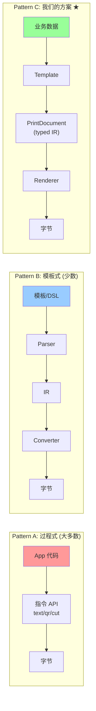

# 类似项目深度分析 / Competitive Architecture Analysis
# 打印 SDK 开源项目对比研究

---

## 1. 分析对象总览 / Projects Analyzed

| # | 项目 | 语言 | ⭐ | 架构特点 |
|---|------|------|-----|---------|
| 1 | **bluetooth_print_plus** | Flutter/Dart | 88 | MethodChannel + 3 指令类 |
| 2 | **esc_pos_utils_plus** | Dart | 49 | 纯指令生成库 |
| 3 | **ticketfile** ★ | Go | 39 | **DSL → Parser → Converter(接口) → 多输出** |
| 4 | **python-escpos** | Python | 900+ | 过程式 API + printer-db |
| 5 | **py-xml-escpos** | Python | 74 | **XML 模板 → ESC/POS** |
| 6 | **PrinterPlusCOMM** | Android/Java | 100+ | 连接抽象 + ESC/POS |
| 7 | **PAPPL (CUPS)** | C | 200+ | 企业级驱动架构 |

---

## 2. 逐个深度分析 / Detailed Analysis

### 2.1 ★ ticketfile (Go) — 最接近我们目标架构

📍 [github.com/bamarni/ticketfile](https://github.com/bamarni/ticketfile)

**架构**:
```
Ticketfile (DSL文本) → Parser → []Command → Converter接口 → 字节输出
```

**核心代码 `engine.go`**:
```go
type Converter interface {
    Convert(cmd Command) ([]byte, error)  // ← 协议编译器接口
}

type Engine struct {
    conv Converter
    w    *bufio.Writer
}

func (e *Engine) Render(r io.Reader) error {
    cmds, _ := parse(r)        // ← 解析 DSL → 命令列表
    for _, cmd := range cmds {
        rawBytes, _ := e.conv.Convert(cmd)  // ← 命令 → 协议字节
        e.w.Write(rawBytes)     // ← 输出
    }
    return e.w.Flush()
}
```

**Ticketfile DSL 语法** (文本描述"打印什么"):
```
INIT
ALIGN CENTER
FONT B
PRINTLF MY RESTAURANT
FONT A
PRINTLF 123 Main Street
LF 2
ALIGN LEFT
PRINTLF 1x Coffee         $3.50
PRINTLF 1x Muffin         $2.00
LF
ALIGN RIGHT
PRINTLF Total: $5.50
CUT
```

**两个 Converter 实现**:
- `escpos/converter.go` → ESC/POS 字节
- `html/converter.go` → HTML 预览

| 优点 | 缺点 |
|------|------|
| ✅ **模板-指令完全分离** | ❌ 仅支持 ESC/POS + HTML |
| ✅ Converter 接口设计优雅 | ❌ DSL 不支持图标/QR/条码 |
| ✅ 语言无关 (纯文本 DSL) | ❌ 无连接层 (仅 stdout 输出) |
| ✅ 可序列化/可传输 | ❌ 不支持 TSPL/CPCL |

> [!TIP]
> **ticketfile 的 `Converter` 接口设计与我们方案中的 `CommandRenderer` 完全一致**。但我们的 `PrintDocument` 用 sealed class 替代文本 DSL，获得了编译时类型安全。

---

### 2.2 bluetooth_print_plus (Flutter) — 当前最相似的 Flutter 包

📍 [github.com/amoLink/bluetooth_print_plus](https://github.com/amoLink/bluetooth_print_plus)

**架构**:
```
App → EscCommand / TscCommand / CpclCommand → MethodChannel → Native SDK → 蓝牙
      ↑ 调用方自己选+自己拼                    ↑ 指令在 native 构建
```

**代码结构**:
```
lib/src/
├── blue.dart           # 蓝牙连接 (静态单例)
├── blue_device.dart    # 设备模型
├── esc_command.dart     # ESC/POS 指令 (通过 MethodChannel)
├── tsc_command.dart     # TSC/TSPL 指令 (通过 MethodChannel)
├── cpcl_command.dart    # CPCL 指令 (通过 MethodChannel)
├── enum_tool.dart       # 枚举转换
└── utils.dart           # 工具
```

**使用方式** (调用方直接操作指令):
```dart
// 没有模板层 — 业务代码直接拼指令
final esc = EscCommand();
await esc.cleanCommand();
await esc.text(content: "Hello", fontSize: EscFontSize.size2);
await esc.code128(content: "12345");
await esc.qrCode(content: "https://...");
final data = await esc.getCommand();
await BluetoothPrintPlus.write(data!);
```

| 优点 | 缺点 |
|------|------|
| ✅ 支持 ESC + TSC + CPCL 三种协议 | ❌ **无模板层**，业务直接拼指令 |
| ✅ MethodChannel 利用 native 能力 | ❌ **无连接抽象**，仅蓝牙 |
| ✅ API 简洁 | ❌ 3 个 Command 类无公共接口 |
| ✅ Flutter 生态 | ❌ 指令构建是异步的 (每次 await) |

---

### 2.3 esc_pos_utils_plus (Dart) — 最成熟的 ESC/POS 指令库

📍 pub.dev/packages/esc_pos_utils_plus (17,728/wk)

**职责**: 纯指令生成，不管连接

```dart
final generator = Generator(PaperSize.mm80, profile);
List<int> bytes = [];
bytes += generator.text('Hello', styles: PosStyles(align: PosAlign.center));
bytes += generator.qrcode('https://...');
bytes += generator.cut();
// bytes → 自行发送到打印机
```

| 优点 | 缺点 |
|------|------|
| ✅ **最成熟的 ESC/POS 实现** (17k/wk) | ❌ 仅 ESC/POS，不支持 TSPL/CPCL |
| ✅ CapabilityProfile 支持 400+ 打印机型号 | ❌ 无模板层 |
| ✅ 纯 Dart，可在服务端运行 | ❌ 无连接层 |
| ✅ 图片/条码/QR/中文全支持 | ❌ 过程式 API |

---

### 2.4 python-escpos (Python) — 最完整的参考实现

📍 [github.com/python-escpos](https://github.com/python-escpos) (900+ ⭐)

**架构**:
```
Escpos (基类)
├── Usb(Escpos)       # USB 连接
├── Network(Escpos)   # 网络连接
├── Serial(Escpos)    # 串口连接
└── File(Escpos)      # 文件输出

+ escpos-printer-db (社区维护的打印机能力数据库)
```

| 优点 | 缺点 |
|------|------|
| ✅ **连接 + 指令合一**，使用最简单 | ❌ 仅 ESC/POS |
| ✅ printer-db 支持 400+ 型号 | ❌ **无模板层** |
| ✅ 文档完善、社区活跃 | ❌ Python 限定 |
| ✅ 连接层有抽象 (基类继承) | ❌ 继承而非组合 |

---

### 2.5 py-xml-escpos (Python) — XML 模板方案

📍 [github.com/fvdsn/py-xml-escpos](https://github.com/fvdsn/py-xml-escpos) (74 ⭐)

**模板格式** (XML):
```xml
<receipt>
  <h1>My Restaurant</h1>
  <line><left>Coffee</left><right>$3.50</right></line>
  <line><left>Muffin</left><right>$2.00</right></line>
  <hr />
  <h2 align="right">Total: $5.50</h2>
  <barcode>12345678</barcode>
  <cut />
</receipt>
```

| 优点 | 缺点 |
|------|------|
| ✅ **声明式模板**，类似 HTML | ❌ 仅 ESC/POS 输出 |
| ✅ 可序列化、可远程下发 | ❌ Python 限定 |
| ✅ 所见即所得的语义 | ❌ XML 解析开销 |

---

### 2.6 PAPPL / CUPS (C) — 企业级架构参考

```
Application → IPP Protocol → PAPPL Daemon → Printer Driver → Hardware
                                ↓
                        Web UI (配置/管理)
```

| 设计理念 | 对我们的启发 |
|---------|-------------|
| 打印作业与驱动完全分离 | PrintDocument 与 Renderer 分离 |
| 驱动通过"Printer Application"插件化 | Adapter 插件化 |
| 支持多打印机管理 | 多设备管理 |
| Web UI 配置界面 | 设置 Screen |

---

## 3. 架构模式对比 / Architecture Pattern Comparison



| 维度 | Pattern A (过程式) | Pattern B (DSL模板) | Pattern C (我们) |
|------|-------------------|-------------------|-----------------|
| **代表** | python-escpos, bluetooth_print_plus, esc_pos_utils_plus | ticketfile, py-xml-escpos | xii_printer (新设计) |
| **模板-指令分离** | ❌ 无 | ✅ 有 (文本/XML) | ✅ 有 (typed) |
| **类型安全** | ⚠️ 部分 | ❌ 无 (字符串) | ✅ **sealed class 编译检查** |
| **多协议支持** | ❌ 通常仅 ESC | ❌ 通常仅 ESC | ✅ ESC + TSPL + CPCL + 扩展 |
| **连接抽象** | ⚠️ 部分 | ❌ 无 | ✅ Adapter 接口 |
| **可序列化** | ❌ | ✅ DSL 文本 | ✅ PrintDocument 可 JSON 化 |
| **IDE 支持** | ✅ 方法提示 | ❌ 纯文本无提示 | ✅ **完整类型提示** |
| **新增元素** | 各自实现 | 改 Parser+Converter | **编译器强制所有 Renderer 处理** |

---

## 4. 关键发现 / Key Findings

### 🔍 现有 Flutter 生态中没有项目实现模板-指令分离

在 Dart/Flutter 生态中，**所有现有打印 SDK 都是 Pattern A (过程式)**：
- 业务代码直接调用 `text()`, `qrCode()`, `cut()` 
- 指令构建散布在各处
- 切换协议 (ESC→TSPL) 需要重写所有打印代码

### 🎯 ticketfile 是架构上最接近的参考

`ticketfile` 的 `Converter` 接口 = 我们的 `CommandRenderer`
`ticketfile` 的 `Command` 列表 = 我们的 `PrintDocument.elements`

**但我们的方案有 3 个关键优势**:

| 优势 | ticketfile | 我们 |
|------|-----------|------|
| **类型安全** | 文本 DSL，运行时才能发现错误 | sealed class，**编译时** 发现错误 |
| **多协议** | 仅 ESC/POS + HTML | ESC + TSPL + CPCL + 扩展 |
| **端到端** | 仅文档→字节，无连接层 | 文档→字节→设备，**全链路** |

### 💡 py-xml-escpos 的 XML 方案值得借鉴

如果未来需要**远程下发模板** (服务器配置打印格式)，可以参考 py-xml-escpos 的 XML 方案，在 PrintDocument 上增加 JSON/XML 序列化支持：

```json
{
  "paperSize": "mm80",
  "elements": [
    {"type": "text", "text": "{{company}}", "align": "center", "size": "size2"},
    {"type": "divider"},
    {"type": "textRow", "columns": [
      {"text": "运单号:{{ticketSn}}", "ratio": 1},
      {"text": "流水号:{{seqId}}", "ratio": 1}
    ]},
    {"type": "qrCode", "data": "{{qrUrl}}", "size": 6},
    {"type": "cut"}
  ]
}
```

---

## 5. 结论与建议 / Conclusion

> [!IMPORTANT]
> **在开源市场中，没有任何 Flutter/Dart 项目同时实现了：**
> 1. ✅ 模板-指令分离
> 2. ✅ 多协议支持 (ESC + TSPL + CPCL)
> 3. ✅ 多连接方式支持 (BLE + Classic BT + Network + USB)
> 4. ✅ 类型安全的文档模型
>
> **如果我们按照方案实现，这将是 Dart 生态中架构最先进的打印 SDK。**

### 可借鉴的设计

| 来源 | 借鉴什么 |
|------|---------|
| **ticketfile** | `Converter` 接口模式 → 我们的 `CommandRenderer` |
| **esc_pos_utils_plus** | CapabilityProfile 打印机能力数据库 → 我们的 `PrinterProfile` |
| **python-escpos** | printer-db 社区打印机库 → `printers.json` 扩展 |
| **py-xml-escpos** | XML 模板可序列化 → 未来 JSON 模板远程下发 |
| **PAPPL** | 打印作业与驱动完全解耦 → PrintDocument ↔ Renderer ↔ Adapter |
