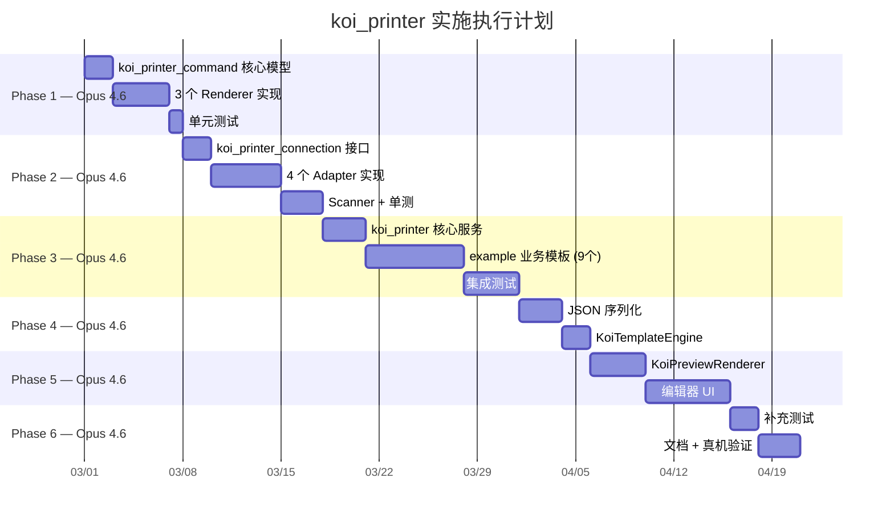

# koi_printer 实施执行手册 v1.0
# Implementation Execution Guide v1.0

> **关联文档**: [architecture_upgrade_plan.md](./architecture_upgrade_plan.md) v5.0
> **创建日期**: 2026-02-26
> **总工期**: 约 7-8 周

---

## 执行总览 / Execution Overview



---

## 模型分工策略 / Model Assignment Strategy

| Phase | 模型 | 原因 |
|-------|------|------|
| **Phase 1-3** | **Opus 4.6** | 核心架构实现，需要深度理解旧代码 + 跨文件协调 20+ 紧密耦合类 |
| **Phase 4** | **Opus 4.6** | JSON 序列化需与 Phase 1 model 定义完全对齐，上下文连贯性最优 |
| **Phase 5** | **Opus 4.6** | 编辑器 UI 需理解全部 20+ 元素类型 + Renderer 逻辑 |
| **Phase 6** | **Opus 4.6** | 测试需覆盖复杂边界条件，文档需精准理解设计意图 |
| **Bug fix** | **Opus 4.6** | 能理解 “为什么” 出错，而不只修改表面症状 |

---

## 基础规则 / Ground Rules 🏗️

### 代码质量: very_good_analysis (最严格校验)

> [!IMPORTANT]
> **所有 3 个 koi_* 包必须使用 `very_good_analysis` 最严格 lint 规则。**
> 这是发布到 pub.dev 的质量保障基线。

**包信息**: `very_good_analysis: ^10.2.0` (by Very Good Ventures, 160/160 pub points, 744 likes)

#### 每个包的 `analysis_options.yaml`

```yaml
# analysis_options.yaml (三个包统一使用)
include: package:very_good_analysis/analysis_options.yaml

# 仅在确实需要时才添加例外，并附注释说明原因
# linter:
#   rules:
#     public_member_api_docs: false  # 初期可暂关，Phase 6 打开
```

#### 每个包的 `pubspec.yaml` dev_dependencies

```yaml
dev_dependencies:
  very_good_analysis: ^10.2.0
  test: ^1.25.0
  mocktail: ^1.0.4
```

### very_good_analysis 核心规则 (摘要)

| 规则类别 | 规则示例 | 影响 |
|---------|---------|------|
| **公开 API 文档** | `public_member_api_docs` | 所有公开类/方法必须有 `///` 文档注释 |
| **严格类型** | `strict_raw_type`, `avoid_dynamic_calls` | 禁止裸泛型、禁止 `dynamic` 调用 |
| **不可变** | `prefer_const_constructors`, `prefer_const_declarations` | 优先 const |
| **空安全** | `cast_nullable_to_non_nullable` | 严格 null 安全 |
| **命名** | `file_names`, `library_prefixes` | 文件名 snake_case |
| **导入** | `prefer_relative_imports`, `sort_constructors_first` | 规范导入顺序 |
| **代码风格** | `lines_longer_than_80_chars` (仅 warning) | 行宽控制 |
| **测试** | `test_types_in_equals` | equals/hashCode 一致性 |

### 开发约定

| 约定 | 要求 |
|------|------|
| **语言版本** | `sdk: ^3.7.0` (最新稳定 Dart 3) |
| **空安全** | 100% sound null safety |
| **文档注释** | 所有公开 API 必须 `///` (Phase 6 前可暂缓) |
| **测试覆盖率** | 目标 > 60%，核心 Renderer > 80% |
| **Git Commit** | Conventional Commits (`feat:`, `fix:`, `refactor:`) |
| **分支策略** | `main` (稳定) / `dev` (开发) / `feature/phase-N` |
| **CI 检查** | `flutter analyze` + `flutter test` 全绿才能合并 |

### 项目创建后立即执行的标准操作

```bash
# 1. 创建包
flutter create --template=package koi_printer_command
cd koi_printer_command

# 2. 添加 very_good_analysis
flutter pub add --dev very_good_analysis

# 3. 创建 analysis_options.yaml
echo 'include: package:very_good_analysis/analysis_options.yaml' > analysis_options.yaml

# 4. 删除默认 lint 配置
# (flutter create 会生成默认的 analysis_options.yaml，需覆盖为 very_good_analysis)

# 5. 首次检查
flutter analyze
```

---

## Phase 1: 新建 koi_printer_command 📦

> **执行模型**: Opus 4.6 | **工期**: 1 周 | **风险**: 低

### 1.1 项目创建

```bash
cd /Volumes/Workspace/WORKSPACE/SourceCode/xii/xii_engine/packages/
flutter create --template=package koi_printer_command
```

**产出**: 空包骨架 + `pubspec.yaml`

### 1.2 依赖配置

```yaml
# koi_printer_command/pubspec.yaml
name: koi_printer_command
description: Print document model and command renderers for koi_printer.
version: 0.1.0

environment:
  sdk: ^3.7.0

dependencies:
  hex: ^0.2.0
  gbk_codec: ^0.5.0
  image: ^4.5.0
  zxing2: ^0.2.4

dev_dependencies:
  very_good_analysis: ^10.2.0
  test: ^1.25.0
  mocktail: ^1.0.4
```

### 1.3 核心模型文件 Checklist

| # | 文件 | 主类 | 旧代码参考 | 状态 |
|---|------|------|-----------|:---:|
| 1 | `lib/src/model/koi_print_document.dart` | `KoiPrintDocument` | (新设计) | [ ] |
| 2 | `lib/src/model/koi_print_element.dart` | `KoiPrintElement` sealed + 20个子类 | (新设计，参考 §7.1) | [ ] |
| 3 | `lib/src/model/koi_print_result.dart` | `KoiPrintResult` sealed class | (新设计) | [ ] |
| 4 | `lib/src/model/koi_command_protocol.dart` | `KoiCommandProtocol` enum | 旧 `types/` | [ ] |
| 5 | `lib/src/model/koi_qr_render_strategy.dart` | `KoiQrRenderStrategy` enum (6种) | 旧 QR 分支逻辑 | [ ] |
| 6 | `lib/src/model/koi_paper_types.dart` | `KoiPaperType`, `KoiPaperSize`, `KoiLayoutMode` 等枚举 | 旧 `types/` | [ ] |

### 1.4 Renderer 实现 Checklist

| # | 文件 | 主类 | 旧代码参考 | 行数估算 | 状态 |
|---|------|------|-----------|---------|:---:|
| 7 | `lib/src/renderer/koi_command_renderer.dart` | `KoiCommandRenderer` 接口 | (新设计) | ~20 | [ ] |
| 8 | `lib/src/renderer/koi_esc_pos_renderer.dart` | `KoiEscPosRenderer` | `command/esc/*.dart` (8文件, ~900 LOC) | ~500 | [ ] |
| 9 | `lib/src/renderer/koi_tspl_renderer.dart` | `KoiTsplRenderer` | `command/tspl/*.dart` | ~200 | [ ] |
| 10 | `lib/src/renderer/koi_cpcl_renderer.dart` | `KoiCpclRenderer` | `command/cpcl/*.dart` | ~200 | [ ] |

### 1.5 ESC/POS Renderer 关键实现细节

> [!WARNING]
> 这是 Phase 1 最复杂的文件，需要从旧代码 8 个 ESC 文件中提取逻辑。

**必须覆盖的功能**:

| 功能 | 旧文件 | 关键逻辑 |
|------|--------|---------|
| 文本渲染 | `xii_esc_pos_paper.dart` | ESC命令字节: `[0x1B, 0x61, align]` 等 |
| 多列文本 | `xii_esc_pos_paper.dart` | 按 `dotsPerLine` 计算列宽 |
| QR 6策略 | `xii_esc_pos_paper.dart` → `addQRAllInOne()` | 6个分支: normal/legend/original/zk/img/barcode |
| 图片光栅化 | `xii_esc_pos_paper.dart` | `image` 库转栅格 + ESC/POS 位图指令 |
| 中文编码 | `xii_esc_pos_paper.dart` | `gbk_codec` 编码 |
| 切纸指令 | `xii_esc_pos_paper.dart` | `[0x1D, 0x56, mode]` |

### 1.6 单元测试

```bash
cd koi_printer_command
flutter test
```

| 测试文件 | 覆盖范围 |
|---------|---------|
| `test/model/koi_print_document_test.dart` | Document 创建 + 元素组合 |
| `test/renderer/koi_esc_pos_renderer_test.dart` | **对比旧 ESC 输出字节一致** |
| `test/renderer/koi_tspl_renderer_test.dart` | TSPL 指令序列验证 |
| `test/renderer/koi_cpcl_renderer_test.dart` | CPCL 指令序列验证 |

### 1.7 旧代码覆盖 Checklist

完成后在旧文件上标记 ✅:

- [ ] `command/esc/xii_esc_pos_generator.dart`
- [ ] `command/esc/xii_esc_pos_paper.dart`
- [ ] `command/esc/xii_esc_pos_enum.dart`
- [ ] `command/esc/xii_esc_pos_column.dart`
- [ ] `command/esc/xii_esc_pos_image_utils.dart`
- [ ] `command/esc/xii_esc_pos_page.dart`
- [ ] `command/esc/xii_esc_pos_qr_type.dart`
- [ ] `command/esc/xii_esc_pos_result.dart`
- [ ] `command/tspl/*.dart`
- [ ] `command/cpcl/*.dart`

### 1.8 Phase 1 验收标准

- [ ] `flutter analyze` 零 error、零 warning (very_good_analysis)
- [ ] `flutter test` 全绿
- [ ] Renderer 输出字节与旧代码 **逐字节对比一致**
- [ ] 全部旧 command 文件标记 ✅

---

## Phase 2: 新建 koi_printer_connection 📡

> **执行模型**: Opus 4.6 | **工期**: 1-2 周 | **风险**: 中

### 2.1 项目创建

```bash
cd /Volumes/Workspace/WORKSPACE/SourceCode/xii/xii_engine/packages/
flutter create --template=plugin koi_printer_connection
```

### 2.2 依赖配置

```yaml
# koi_printer_connection/pubspec.yaml
name: koi_printer_connection
description: Printer connection adapters and device scanners for koi_printer.
version: 0.1.0

environment:
  sdk: ^3.7.0
  flutter: ">=3.27.0"

dependencies:
  flutter:
    sdk: flutter
  flutter_blue_plus: ^1.35.0    # 先锁 1.x，后规划 2.x
  flutter_bluetooth_classic_serial: ^1.3.2

dev_dependencies:
  very_good_analysis: ^10.2.0
  flutter_test:
    sdk: flutter
  mocktail: ^1.0.4
```

### 2.3 接口层 Checklist

| # | 文件 | 主类 | 状态 |
|---|------|------|:---:|
| 1 | `lib/src/adapter/koi_printer_adapter.dart` | `KoiPrinterAdapter` 接口 | [ ] |
| 2 | `lib/src/policy/koi_connection_policy.dart` | `KoiConnectionPolicy` | [ ] |
| 3 | `lib/src/model/koi_connection_config.dart` | `KoiConnectionConfig` | [ ] |
| 4 | `lib/src/model/koi_connection_state.dart` | `KoiConnectionState`, `KoiConnectionResult` | [ ] |
| 5 | `lib/src/model/koi_connection_type.dart` | `KoiConnectionType` enum | [ ] |
| 6 | `lib/src/scanner/koi_device_scanner.dart` | `KoiDeviceScanner` 接口 | [ ] |

### 2.4 Adapter 实现 Checklist

| # | 文件 | 主类 | 旧代码参考 | 关键逻辑 | 状态 |
|---|------|------|-----------|---------|:---:|
| 7 | `koi_ble_adapter.dart` | `KoiBleAdapter` | `xii_bluetooth_printer.dart` | MTU chunking + 8ms 延迟 + 240→10次重试 | [ ] |
| 8 | `koi_classic_bt_adapter.dart` | `KoiClassicBtAdapter` | `xii_bluetooth_serial_printer.dart` | 2s 自动断连 | [ ] |
| 9 | `koi_network_adapter.dart` | `KoiNetworkAdapter` | `xii_network_printer.dart` | Socket 连接 + fallback | [ ] |
| 10 | `koi_usb_adapter.dart` | `KoiUsbAdapter` | `xii_usb_printer.dart` | USB 通道 | [ ] |

### 2.5 Scanner 实现 Checklist

| # | 文件 | 主类 | 旧代码参考 | 状态 |
|---|------|------|-----------|:---:|
| 11 | `koi_ble_scanner.dart` | `KoiBleScanner` | `xii_bluetooth_service.dart` | [ ] |
| 12 | `koi_classic_bt_scanner.dart` | `KoiClassicBtScanner` | `xii_bluetooth_serial_service.dart` | [ ] |
| 13 | `koi_network_scanner.dart` | `KoiNetworkScanner` | `xii_network_service.dart` (替代 `ping_discover_network_forked`) | [ ] |
| 14 | `koi_usb_scanner.dart` | `KoiUsbScanner` | `xii_usb_service.dart` | [ ] |

### 2.6 BLE Adapter 关键实现细节

> [!WARNING]
> 这是 Phase 2 最复杂的组件，旧代码逻辑散落多处。

| 关键逻辑 | 旧代码位置 | 新实现位置 |
|---------|-----------|-----------|
| MTU 分块发送 | `partition(bytes, mtu)` in base_printer | `KoiBleAdapter.sendData()` |
| 8ms 平台延迟 | `Future.delayed(8ms)` 每块之间 | `KoiBleAdapter._sendChunk()` |
| 自动重连 3s | `_autoConnectDuration = 3s` | `KoiConnectionPolicy.autoReconnectInterval` |
| 重试 240→10次 | 硬编码 loop | `KoiConnectionPolicy.maxRetries = 10` |
| 连接延迟 20ms | `connectDelayDuration = 20ms` | `KoiConnectionPolicy.retryDelay` |
| 硬件状态监听 | `hardwareStateStream` | `KoiPrinterAdapter.hardwareStateStream` |

### 2.7 单元测试

```bash
cd koi_printer_connection
flutter test
```

| 测试文件 | 覆盖范围 |
|---------|---------|
| `test/adapter/koi_ble_adapter_test.dart` | Mock BLE 连接 + MTU chunking 验证 |
| `test/policy/koi_connection_policy_test.dart` | 重试策略 + 超时 |
| `test/scanner/koi_ble_scanner_test.dart` | Mock 扫描结果 |

### 2.8 Phase 2 验收标准

- [ ] `flutter analyze` 零 error (very_good_analysis)
- [ ] Mock 测试全绿
- [ ] **BLE 真机连接测试** (需要实际打印机)
- [ ] MTU 分块逻辑验证 (与旧代码行为一致)
- [ ] 全部旧 devices/ + services/ 文件标记 ✅

---

## Phase 3: 新建 koi_printer + 业务模板 🖨️

> **执行模型**: Opus 4.6 | **工期**: 2 周 | **风险**: 中

### 3.1 项目创建

```bash
cd /Volumes/Workspace/WORKSPACE/SourceCode/xii/xii_engine/packages/
flutter create --template=package koi_printer
```

### 3.2 依赖配置

```yaml
# koi_printer/pubspec.yaml
name: koi_printer
description: A complete printer management solution for ticket and label printing.
version: 0.1.0

environment:
  sdk: ^3.7.0
  flutter: ">=3.27.0"

dependencies:
  flutter:
    sdk: flutter
  koi_printer_command:
    path: ../koi_printer_command
  koi_printer_connection:
    path: ../koi_printer_connection
  shared_preferences: ^2.5.4
  printing: ^5.14.2
  qr_flutter: ^4.1.0
  barcode: ^2.2.8

dev_dependencies:
  very_good_analysis: ^10.2.0
  flutter_test:
    sdk: flutter
  mocktail: ^1.0.4
```

### 3.3 核心服务 Checklist

| # | 文件 | 主类 | 旧代码参考 | 状态 |
|---|------|------|-----------|:---:|
| 1 | `lib/src/service/koi_printer_manager.dart` | `KoiPrinterManager` | `xii_printer_service.dart` | [ ] |
| 2 | `lib/src/service/koi_print_job_queue.dart` | `KoiPrintJobQueue` | Queue + Future.delayed 模式 | [ ] |
| 3 | `lib/src/config/koi_print_config.dart` | `KoiPrintConfig` + `KoiRendererConfig` | `xii_printer_config.dart` 拆分 | [ ] |
| 4 | `lib/src/config/koi_user_preferences.dart` | `KoiUserPreferences` | `xii_pint_settings.dart` | [ ] |
| 5 | `lib/src/storage/koi_printer_storage.dart` | `KoiPrinterStorage` | `xii_printer_storage.dart` | [ ] |
| 6 | `lib/src/model/koi_printer_profile.dart` | `KoiPrinterProfile` | `xii_printer_profile.dart` 扩展 | [ ] |
| 7 | `lib/src/model/koi_printer_constants.dart` | 常量定义 | `papper/xii_papper_const.dart` | [ ] |
| 8 | `lib/src/template/koi_print_template.dart` | `KoiPrintTemplate<T>` 抽象接口 | (新设计) | [ ] |

### 3.4 Example 模板 Checklist

> **全部 9 个业务模板 + 2 个 Demo 模板放在 example/ 中**

| # | 文件 | 主类 | 旧代码参考 | 关键功能 | 状态 |
|---|------|------|-----------|---------|:---:|
| 9 | `example/templates/simple_receipt_template.dart` | `SimpleReceiptTemplate` | (新 Demo) | 通用小票示例 | [ ] |
| 10 | `example/templates/simple_label_template.dart` | `SimpleLabelTemplate` | (新 Demo) | 通用标签示例 | [ ] |
| 11 | `example/templates/koi_sender_ticket_template.dart` | `KoiSenderTicketTemplate` | `xii_sender_ticket.dart` | **多联**: 客户联+存根联 | [ ] |
| 12 | `example/templates/koi_receiver_ticket_template.dart` | `KoiReceiverTicketTemplate` | `xii_recevier_ticket.dart` | 收货小票 | [ ] |
| 13 | `example/templates/koi_delivery_note_template.dart` | `KoiDeliveryNoteTemplate` | `xii_issued_papper.dart` | 发放明细 | [ ] |
| 14 | `example/templates/koi_deposit_template.dart` | `KoiDepositTemplate` | `xii_payment_papper.dart` | 缴款单 | [ ] |
| 15 | `example/templates/koi_refund_ticket_template.dart` | `KoiRefundTicketTemplate` | `xii_back_ticket.dart` | 退票 | [ ] |
| 16 | `example/templates/koi_payment_request_template.dart` | `KoiPaymentRequestTemplate` | `xii_tms_papper_generator.dart` | 交款申请 | [ ] |
| 17 | `example/templates/koi_test_ticket_template.dart` | `KoiTestTicketTemplate` | `xii_tms_papper_generator.dart` | 测试小票 | [ ] |
| 18 | `example/templates/koi_sender_label_template.dart` | `KoiSenderLabelTemplate` | `xii_sender_label.dart` | **6种公司样式** | [ ] |

### 3.5 KoiPrinterManager 关键实现

```
KoiPrinterManager
├── ticketAdapter: KoiPrinterAdapter?   ← 小票打印机
├── labelAdapter: KoiPrinterAdapter?    ← 标签打印机
├── _ticketQueue: KoiPrintJobQueue
├── _labelQueue: KoiPrintJobQueue
│
├── connectAll(storage) → 从存储恢复连接
├── disconnectAll()
├── printTicket<T>(template, data, config) → KoiPrintResult
└── printLabel<T>(template, data, config) → KoiPrintResult
```

### 3.6 集成测试

```bash
cd koi_printer
flutter test
```

| 测试 | 覆盖范围 |
|------|---------|
| `test/service/koi_printer_manager_test.dart` | Mock Adapter + 双机管理 |
| `test/service/koi_print_job_queue_test.dart` | 队列排序 + 延迟 |
| `test/template/koi_sender_ticket_test.dart` | 多联输出验证 |
| `test/template/koi_sender_label_test.dart` | 6种样式输出验证 |

### 3.7 Phase 3 验收标准

- [ ] `flutter analyze` 零 error (very_good_analysis)
- [ ] 单测全绿
- [ ] **全链路集成测试**: Template → Renderer → Adapter (Mock)
- [ ] **双机真机打印**: 扫描→连接→打印小票(客户联+存根联)+标签(6种样式)
- [ ] 全部旧 papper/ + service 文件标记 ✅

---

## Phase 4: JSON 序列化 + KoiPrinterProfile 📋

> **执行模型**: Opus 4.6 | **工期**: 1 周 | **风险**: 低

### 4.1 为什么用 Opus 4.6?

- 20+ 个 `KoiPrintElement` 子类的 `toJson()` / `fromJson()` 需与 Phase 1 model 定义完全对齐
- `KoiTemplateEngine` 的变量替换和 forEach 展开需理解全部元素类型
- 保持与前 3 个 Phase 的上下文连贯性

### 4.2 Checklist

| # | 任务 | 文件 | 状态 |
|---|------|------|:---:|
| 1 | 20+ 子类 `toJson()` | `koi_print_element.dart` | [ ] |
| 2 | 20+ 子类 `fromJson()` + factory switch | `koi_print_element.dart` | [ ] |
| 3 | `KoiPrintDocument.toJson/fromJson` | `koi_print_document.dart` | [ ] |
| 4 | `KoiTemplateEngine` 变量替换 | `lib/src/engine/koi_template_engine.dart` | [ ] |
| 5 | `KoiTemplateEngine` forEach 展开 | 同上 | [ ] |
| 6 | `KoiPrinterProfile` 数据结构 | `koi_printer_profile.dart` | [ ] |
| 7 | `printers.json` 能力数据库 | `assets/printers.json` | [ ] |
| 8 | Renderer 集成 Profile 能力感知 | `koi_esc_pos_renderer.dart` | [ ] |

### 4.3 实现要点

```
请为以下 20 个 KoiPrintElement 子类生成 toJson/fromJson 方法。
要求:
1. 每个子类的 toJson() 必须包含 'type' 字段 (驼峰命名)
2. fromJson 使用 switch expression on 'type' 字段
3. 枚举类型用 .name 序列化
4. 保持参考文档 §8.1 的格式

子类列表: KoiTextElement, KoiTextRowElement, KoiQrCodeElement, 
KoiBarcodeElement, KoiImageElement, KoiDividerElement, KoiSpacerElement,
KoiCutElement, KoiLabelSetupElement, KoiPositionedTextElement, 
KoiPositionedBarcodeElement, KoiPositionedQrCodeElement,
KoiLabelBoxElement, KoiLabelReverseElement, KoiLabelPrintElement,
KoiForEachElement
```

### 4.4 Phase 4 验收标准

- [ ] 序列化往返测试: `fromJson(toJson(element)) == element` 对全部 20 子类
- [ ] `KoiTemplateEngine` 变量替换 + forEach 展开测试
- [ ] `printers.json` 至少包含 5 个已知打印机型号

---

## Phase 5: 模板编辑器 + 预览 🎨

> **执行模型**: Opus 4.6 | **工期**: 2 周 | **风险**: 低

### 5.1 为什么用 Opus 4.6?

- 编辑器需理解全部 20+ 元素类型的属性结构
- 实时预览需与 Renderer 逻辑完全匹配
- UI 交互需理解模板引擎的变量替换和 forEach 展开逻辑

### 5.2 Checklist

| # | 任务 | 文件 | 状态 |
|---|------|------|:---:|
| 1 | `KoiPreviewRenderer` (流式布局 Widget) | `koi_preview_renderer.dart` | [ ] |
| 2 | 标签预览 (坐标定位 → CustomPaint) | `koi_label_preview.dart` | [ ] |
| 3 | 编辑器主页 UI: 元素列表 + 实时预览 | `koi_template_editor.dart` | [ ] |
| 4 | KoiPrintElement 属性编辑表单 | `koi_element_editor.dart` | [ ] |
| 5 | `ReorderableListView` 拖拽排序 | 集成到编辑器 | [ ] |
| 6 | JSON 导入/导出 | `koi_template_io.dart` | [ ] |
| 7 | QR/条码预览集成 | 集成 `qr_flutter` + `barcode` | [ ] |
| 8 | 连接打印测试按钮 | 集成到编辑器 | [ ] |

### 5.3 实现要点

```
请实现一个 Flutter 模板编辑器 Widget，功能:
1. 左侧: ReorderableListView 显示 KoiPrintElement 列表
2. 右侧: 实时预览 (使用 KoiPreviewRenderer)
3. 点击元素显示属性编辑表单
4. 底部: 工具栏 (添加元素、导入/导出 JSON、打印测试)
5. 使用 Material 3 设计风格
参考 architecture_upgrade_plan.md §10
```

### 5.4 Phase 5 验收标准

- [ ] 流式预览渲染所有元素类型
- [ ] 标签预览使用 CustomPaint 坐标定位
- [ ] 拖拽排序正常工作
- [ ] JSON 导入/导出正确
- [ ] 编辑器 UI 测试

---

## Phase 6: 集成测试 + 文档 + 验证 ✅

> **执行模型**: Opus 4.6 | **工期**: 1 周 | **风险**: 低

### 6.1 为什么用 Opus 4.6?

- 测试需覆盖复杂边界条件（断连重连、MTU 分块异常、QR 策略降级）
- API 文档需精准理解设计意图
- 真机验证问题排查需要全栈理解

### 6.2 测试补充 Checklist

| # | 测试类型 | 覆盖范围 | 状态 |
|---|---------|---------|:---:|
| 1 | 单元测试补充 | 各场景边界条件 | [ ] |
| 2 | 编辑器 Widget 测试 | UI 交互测试 | [ ] |
| 3 | 错误场景测试 | 超时、断连、发送失败 | [ ] |
| 4 | 序列化边界测试 | 空值、超长文本、特殊字符 | [ ] |

### 6.3 文档 Checklist

| # | 文档 | 位置 | 状态 |
|---|------|------|:---:|
| 1 | `koi_printer/README.md` | 包 README | [ ] |
| 2 | `koi_printer_command/README.md` | 包 README | [ ] |
| 3 | `koi_printer_connection/README.md` | 包 README | [ ] |
| 4 | API 文档注释 | 各公开 API | [ ] |
| 5 | `CHANGELOG.md` | 各包 | [ ] |

### 6.4 最终验证 Checklist

| # | 验证项 | 验证方式 | 状态 |
|---|--------|---------|:---:|
| 1 | `flutter analyze` 三个包 零 error | very_good_analysis 最严格校验 | [ ] |
| 2 | `flutter test` 三个包全绿 | CLI | [ ] |
| 3 | 测试覆盖率 > 60% | `flutter test --coverage` | [ ] |
| 4 | **TMS 宿主切换依赖** | `xii_bluetooth` → `koi_printer*` | [ ] |
| 5 | **真机: BLE 扫描 → 连接** | 实际打印机 | [ ] |
| 6 | **真机: 打印小票 (客户联+存根联)** | 实际打印机 | [ ] |
| 7 | **真机: 打印标签 (6种样式)** | 实际打印机 | [ ] |
| 8 | **真机: 经典蓝牙打印** | 实际打印机 | [ ] |
| 9 | 旧代码 60+ 文件全部 ✅ | 对照 §12 mapping | [ ] |
| 10 | README 完整 | 三个包 | [ ] |

---

## Bug Fix 流程 / Bug Fix Workflow 🐛

> **执行模型**: Opus 4.6

### 适用场景

- 单文件修复 (编译错误、逻辑错误)
- 测试失败修复
- Lint 警告修复
- 小型功能调整

### Prompt 模板

```
修复 koi_printer_command 中的 [具体问题]。
文件: [路径]
错误信息: [粘贴错误]
期望行为: [描述]
```

---

## 附录: 旧代码文件总对照表

> 最终确认: 旧代码 60+ 文件是否全部在新 koi_* 包 (或 example) 中有对应实现。

### 统计

| 包 | 旧文件数 | 新文件预估 |
|----|---------|-----------|
| `koi_printer_connection` | 9 | 14 |
| `koi_printer_command` | ~15 | 10 |
| `koi_printer` (核心) | ~10 | 8 |
| `koi_printer/example` (模板) | ~10 | 11 |
| 合计 | ~44 核心文件 | ~43 新文件 |

> [!TIP]
> 开发过程中持续更新 `architecture_upgrade_plan.md` §12 的 ✅ 列，
> 确保每个旧文件的逻辑都在新代码中有对应位置。
