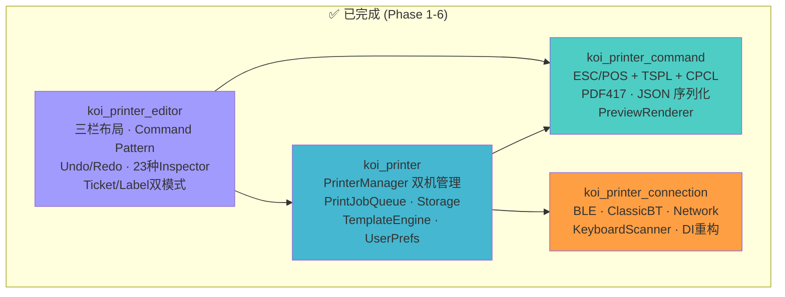
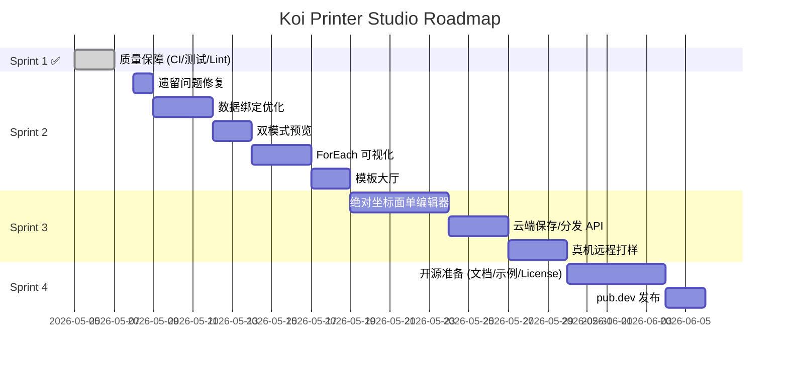

# Koi Printer 生态系统 — 项目审计与路线图
# Koi Printer Ecosystem — Project Audit & Roadmap

> **审计日期 / Date:** 2026-05-07
> **状态 / Status:** Sprint 1 (质量保障) 已完成，进入 Sprint 2 (编辑器商业化)

---

## 1. 当前项目状态总览 / Current Status Overview

### 1.1 代码健康指标 / Code Health Metrics

| Package | Tests | Coverage | Lint | CI Status |
|:---|:---:|:---:|:---:|:---:|
| `koi_printer_command` | 168 | **90.2%** ✅ | 0 issues ✅ | ✅ |
| `koi_printer_connection` | 68 | **94.3%** ✅ | 0 issues ✅ | ✅ |
| `koi_printer` | 184 | **97.1%** ✅ | 0 issues ✅ | ⚠️ 1 flaky |
| `koi_printer_editor` | 74 | **90.2%** ✅ | 0 issues ✅ | ✅ |
| **TOTAL** | **494** | **>90%** | **0** | — |

> [!WARNING]
> `koi_printer` 包有 1 个不稳定测试 (`connectAll handles label adapter connect error`)，时而 pass 时而 fail（可能是 async timing 问题）。需要修复。

### 1.2 基础设施 / Infrastructure

| 项目 | 状态 |
|:---|:---:|
| GitHub Actions CI | ✅ 已配置（格式化 + 静态分析 + 测试 + 覆盖率门槛） |
| 覆盖率门槛 | ✅ 90%，使用 `--concurrency=1` |
| Pre-commit Hook | ✅ `dart format` + `flutter analyze` |
| README | ✅ 含 Badge、使用示例、迁移指南 |
| CHANGELOG | ✅ 各包已更新 |

### 1.3 架构已完成的能力 / Completed Capabilities



---

## 2. 差距分析 / Gap Analysis

### 2.1 已完成 vs 规划对照 / Completed vs Planned

根据 [architecture_upgrade_plan.md](file:///Users/max/Workspace/SourceCode/mrkoi/koit_printer/docs/architecture_upgrade_plan.md) 和 [koi_editor_architecture_plan.md](file:///Users/max/Workspace/SourceCode/mrkoi/koit_printer/docs/koi_editor_architecture_plan.md) 的规划：

| Phase | 描述 | 状态 |
|:---|:---|:---:|
| Phase 1 | 核心基础：EditorState + Undo/Redo 栈 + JSON 序列化 | ✅ 完成 |
| Phase 2 | 流式编辑器：组件面板 → 画布添加 → 拖拽排序 → 属性面板 | ✅ 完成 |
| Phase 3 | 数据绑定：变量下拉、双模式预览、ForEach 可视化、模板大厅 | 🔲 **未开始** |
| Phase 4 | 高级交互：绝对坐标面单拖拽、网格吸附、智能对齐 | 🔲 未开始 |

### 2.2 编辑器当前能力清单 / Editor Feature Matrix

| 功能 | 小票模式 | 标签模式 | 备注 |
|:---|:---:|:---:|:---|
| 组件面板 (添加元素) | ✅ | ✅ | 左侧面板 |
| 图层树 (选中/排序) | ✅ | ✅ | 支持 18 种元素类型 |
| 数据源字段管理 | ✅ | ✅ | 增删改 KoiTemplateField |
| 右侧属性检查器 | ✅ | ✅ | 23 种独立 Inspector |
| Undo / Redo | ✅ | ✅ | Command Pattern |
| 模板加载/切换 | ✅ | ✅ | mock_templates 资产文件 |
| 缩放控制 | ✅ | ✅ | zoomIn/zoomOut |
| **变量下拉绑定** | ❌ | ❌ | Phase 3 |
| **双模式预览 (编辑/真实数据)** | ❌ | ❌ | Phase 3 |
| **ForEach 可视化容器** | ❌ | ❌ | Phase 3 |
| **模板大厅 (Gallery)** | ❌ | ❌ | Phase 3 |
| **绝对坐标拖拽** | ❌ | ❌ | Phase 4 |
| **云端保存/分发** | ❌ | ❌ | Phase 4+ |

### 2.3 已知技术债务 / Known Technical Debt

| # | 问题 | 严重性 | 位置 |
|:---|:---|:---:|:---|
| 1 | `koi_printer` 有 1 个 flaky 测试 | 🟡 | `koi_service_test.dart` |
| 2 | `left_palette.dart` 覆盖率仅 70%（整体靠其他文件 100% 拉高到 90%） | 🟢 | `koi_printer_editor` |
| 3 | `koi_print_element_ext.dart` 覆盖率 91%（部分 copyWith 分支未覆盖） | 🟢 | `koi_printer_editor` |
| 4 | `docs/` 中有多份过期规划文档（checkpoints 已全标 DONE） | 🟢 | `docs/` |
| 5 | Pre-commit hook 需要克隆者手动 `git config core.hooksPath .githooks` | 🟢 | `.githooks/` |

---

## 3. 下一步规划 / Next Steps

### Sprint 2: 编辑器商业化 (Editor Commercialization)

> **周期**: 2 周
> **目标**: 将编辑器从"开发者工具"升级为"可交付的零代码产品"

#### Step 1: 修复遗留问题 (1 天)
- [ ] 修复 `koi_printer` 中的 flaky 测试
- [ ] 清理 `docs/` 过期文档，合并为单一 `ROADMAP.md`
- [ ] 在 `README.md` 中添加 pre-commit hook 自动化配置脚本

#### Step 2: 右侧检查器 — 数据绑定优化 (3 天)
> 参考: [data_binding_ux_plan.md](file:///Users/max/Workspace/SourceCode/mrkoi/koit_printer/docs/data_binding_ux_plan.md)

- [ ] 封装 `VariableSelectDropdown` 组件，读取 `EditorState.schema`
- [ ] 在 `TextElementInspector` 中增加"绑定变量"模式
- [ ] 选中变量后，底层自动设置 `{{fieldKey}}`，UI 显示绿色胶囊标签
- [ ] 扩展到 Barcode / QrCode Inspector

#### Step 3: 双模式预览 (2 天)
- [ ] 在 `TopToolbar` 增加 编辑/预览 Toggle 开关
- [ ] 编辑模式：`{{xxx}}` → 高亮中文别名标签 `<运单号>`
- [ ] 预览模式：注入 `mockData` 渲染真实效果
- [ ] `EditorState.isPreviewMode` 已存在，只需对接画布渲染

#### Step 4: ForEach 循环容器可视化 (3 天)
- [ ] 左侧面板增加"循环容器"组件
- [ ] `CenterCanvas` 中渲染为虚线边框容器
- [ ] 支持将子元素拖入循环容器内部
- [ ] 升级 `EditorState` 支持嵌套级联的拖拽排序

#### Step 5: 模板大厅 (2 天)
- [ ] 实现 `TemplateGalleryModal` — 卡片网格展示
- [ ] 支持从资产文件或 JSON 加载模板
- [ ] 一键加载并替换当前编辑状态
- [ ] 支持"另存为新模板"功能

---

## 4. 最终项目目标 / Ultimate Project Vision

### 4.1 产品定位 / Product Positioning

**Koi Printer Studio** = Flutter/Dart 生态中**唯一**同时实现以下能力的打印解决方案：

```
模板-指令分离 + 多协议(ESC/TSPL/CPCL) + 多连接(BLE/BT/Network) + 类型安全 + 可视化编辑器
```

### 4.2 终态目标清单 / Final Goals

| # | 目标 | 当前 | 终态 |
|:---|:---|:---:|:---:|
| 1 | **零代码模板设计** | 代码构建 JSON | 拖拽式所见即所得编辑器 |
| 2 | **云端模板分发** | 本地资产文件 | 服务器 OTA 下发 JSON，免发版更新 |
| 3 | **真机远程打样** | 本地预览 Widget | Web 编辑 → WebSocket → 手机真机打印 |
| 4 | **面单精细设计** | 仅流式排版 | 绝对坐标拖拽 + 网格吸附 + 智能对齐 |
| 5 | **智能设备适配** | 手动选择 QR 策略 | PrinterProfile 自动匹配最佳渲染参数 |
| 6 | **开源发布** | Private repo | pub.dev 发布，成为行业标准 |

### 4.3 里程碑路线 / Milestone Timeline



### 4.4 成功标准 / Definition of Done

当以下所有条件满足时，项目视为**完成 (Feature Complete)**：

1. ✅ 4 个包覆盖率均 ≥ 90%，CI 绿色
2. 🔲 编辑器支持数据绑定下拉 + 双模式预览 + ForEach 可视化
3. 🔲 模板大厅支持加载/保存/切换
4. 🔲 面单模式支持绝对坐标拖拽
5. 🔲 云端 API 支持模板的上传/下载/版本管理
6. 🔲 pub.dev 发布 3 个核心包 (command / connection / printer)

---

> **结论 / Conclusion**: Sprint 1 (质量保障阶段) 已圆满完成——4 个包全部达标 ≥90% 覆盖率，494 项测试全绿，CI 自动化完善。项目现在处于一个坚实的技术基础之上，可以放心进入 Sprint 2 (编辑器商业化) 阶段，重点攻克数据绑定 UX 和模板大厅两个最高价值的功能。
